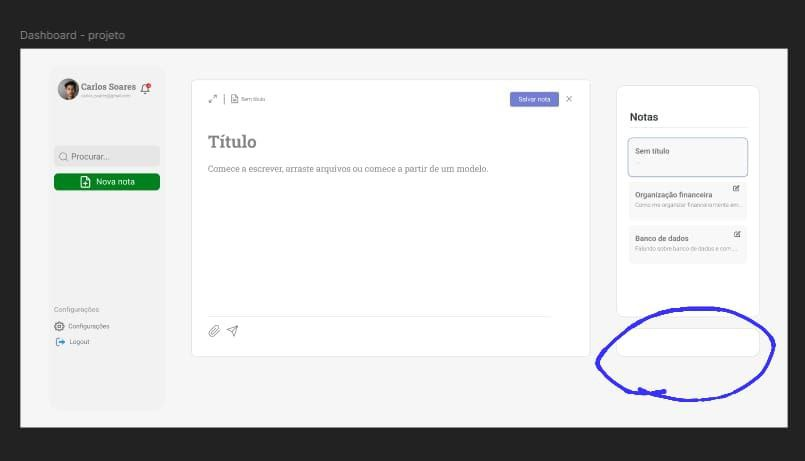

# Simple Editor



A ideia do projeto é fazer um editor de textos web, com **GO** como linguagem do back-end, e para o front-end pretendo usar React e TypeScript

<details>
<summary>Comece aqui</summary>

Para instalar o projeto, é necessário:
- Node (para o pacote npm)
- Golang (pode ser instalado, como exemplo em máquinas que suportam apt, `sudo apt install golang-go`)

Tendo estes dois instalado na máquina, basta seguir os passos descritos no arquivo `./Makefile`, que até a versão 0.1.0 era:

- npm install --prefix ./front-end
- go get github.com/gofiber/fiber/v2
-	npm run build --prefix ./front-end


</details>

<details>
<summary>Pretensões e requisitos técnicos</summary>
O projeto tem as seguintes pretenções:
1. Ser esteticamente agradável
2. Ser "independente" de framawork para front-end
3. Poder exportar PDFs padronizados _(padrão a definir)_
4. Ser fácil de testar e fazer deployment (não requer 10 mil etapas pra implementar mudanças)
5. Ter testes automatizados **(GitHub Actions)**

A escolha da linguagem **GO** para o back-end foi feita pelo fato de que ela permite a compilação de arquivos binário que independe de sistema operacional ou de programas pré instalados na máquina para rodar, e todo o serviço pode ser imbutido num só arquivo binário. Além disso a linguagem permite fácil escalabilidade vertical _(mais cpu == mais performance)_.

</details>


<details>
<summary>Deprecado</summary>


Para instalar o projeto recomendo que tenha **nix** instalado na máquina e que rode os seguintes comandos da raiz do projeto. Caso use __Windows__ recomendo que use ```wsl``` para rodar tudo em ambiente linux.

```bash
nix-shell
make build
```

</details>